<!--
author: chq-matteo
-->
# One binary instrumentation pass to rule them all
Benefits and costs of using timeless debugging to power dynamic program analyses

<!--
# ideas dump

Triaging a software bugs can be challeging especially now that fuzzers produce more and more hard to understand crashes.

Aside from "printf debugging" there are other techniques that can help with the process.

Sanitizer compiler passes add very little overhead and can help finding some context around the crashes of some classes of bugs, but require recompilation, sometimes of every linked library. Conversely tools like valgrind use dynamic binary instrumentation and can work on unmodified binaries at the expense of some additional overhead.

When all else fails, a developer can try to use a software debugger like gdb, lldb, windbg and others. One big weakness of traditional debuggers is that you need to know a priori where to stop the program to inspect it and there is a high price to pay if the program goes past that point (i.e. you need to restart everything from scratch)
Record replay (RR) debuggers can help address some of these issues as they first record some information that can help them to replay an execution trace and then allow to debug the same execution trace any number of times. RR debuggers can often allow fast (i.e. fast enough for interactive debugging) backwards execution that combined with data breakpoint allow a minimalist traversal of the dataflow graph.

Many RR debuggers do not store the whole program state over time in memory, so although you can go backwards into time, fundamentally you are still stuck with sequential exploration of a program trace. Some debuggers (like Tetrane Reven, rr with Pernosco, qira and in a more limited fashion Windbg Preview) allow you to explore the trace freely

In this talk we will explore some of the benefits of writing analyses that work on a timeless trace compared to dynamic instrumentation and also some of the limitations of this techniques.
We will also see how to implement some common analyses that can be useful for fault localization
-->

---
## Who I am


- <!-- .element class="fragment" --> MSc Computer Science student
- <!-- .element class="fragment" --> Play CTF with TRX and mhackeroni
- <!-- .element class="fragment" --> Twitter <a href="https://twitter.com/chqmatteo">@chqmatteo</a>
- <!-- .element class="fragment" --> Github <a href="https://github.com/chq-matteo">chq-matteo</a>


---
## Outline of this presentation
- <!-- .element class="fragment" --> Introduce timeless debuggers available to the public
- <!-- .element class="fragment" --> Show cool things you can do going timeless
- <!-- .element class="fragment" --> Show how to complement dynamic analyses with timeless debugging
- <!-- .element class="fragment" --> Demo: triage a bug with a diy timeless debugger

<!--

Triaging a software bugs can be challeging especially now that fuzzers produce more and more hard to understand crashes.

Dynamic analysis instrumentation passes (valgrind, sanitizers, …) can be used to provide more context around a crash with little overhead, but only for certain classes of bugs.

Record replay (RR) debugging* can be used to record a program execution trace and inspect the program state of the same trace over and over. However debugging sessions can feel overwhelming due to the length of the program trace or the convoluted dataflow or controlflow.

We can write analyses that work on the recorded program traces instead of instrumenting a program so that we can use the RR debugger to further inspect the points of interest found by the dynamic analyses.

In this talk we will explore some of the benefits and limitations of analyses that work on a timeless trace compared to dynamic instrumentation.

We will use a flavour of timeless debugging** that allows fast random access to the program state at any point in time at the expense of higher disk and memory usage.

We will build some common fault localization analyses on top of the timeless debugger as case study.
-->


<!--

*One big weakness of traditional debuggers is that you need to know a priori where to stop the program to inspect it and there is a high price to pay if the program goes past that point (i.e. you need to restart almost everything from scratch).
Record replay (RR) debuggers can help address some of these issues as they first record some information that can help them to replay an execution trace and then allow you to debug the same execution trace any number of times and also to move to a previous program point in time.

**Similar timeless debuggers that work on binaries are Reven by Tetrane, rr with Pernosco, qira by geohot


Moreover many advanced dynamic analyses (e.g. dynamic taint analysis) have an overhead comparable or greater than RR debugging.
-->

---

# What is timeless debugging
## Why is it useful

----

## Traditional debugging

- Guess what did go wrong
- Set breakpoint
- Inspect stuff
- Step, step, step

----

## Debugging: weaknesses

<small>
<ul>
<li>Need to know in advance where to stop</li>
<li>Breakpoints do not define a unique program point</li>
<li>Need to restart to go back to some point (punishes users)</li>
</ul>
</small>


<video preload="metadata" muted controls>
    <source src="assets/lq_gdb4x.mp4" type="video/mp4">
</video>

----

## Record replay debugging

- *Record* program trace
- Debug the *replay*
- The replay is *deterministic*
- You can go back *quickly* and *exactly* to a previous point (timeless)

----

## Compressed traces
- Complete program traces can be very large (all memory and register changes)
- Possible solution:
    - Create a model of a program executor
    - Record only the differences between the real trace and your model
    - The differences are the compressed trace, your model the decompressor

----

## Compressed traces: Example
- model: userspace CPU emulator
- differences:
    - Syscalls effects <span class="fragment">> record syscall events</span>
    - Signals <span class="fragment">> record signal events</span>
    - Multi threading effects <span class="fragment">> serialize threads and record switches</span>
    - ...

----

## Compressed traces: References

- 2006 Framework for instruction-level tracing and analysis of program executions. https://doi.org/10.1145/1134760.1220164 (iDNA/Nirvana)
- For stuff focused on non deterministic events > deterministic replay see VMWare, rr-project.org, PANDA

----

## Indexing a replay

- Non sequential debugging
- Inspect any program point for "free" (**true** timeless / omniscient)
- Single instance can serve multiple independent clients
- But higher memory footprint
    - X bytes * instructions * Y indexing overhead
    - N billions instructions > 1 SSD per trace
---

# Timeless debuggers for binaries

(available to the general public)

----

## Panda

[https://github.com/panda-re/panda](https://github.com/panda-re/panda)
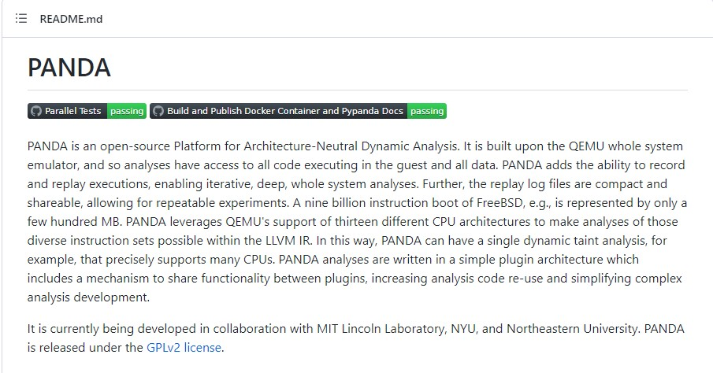


----

## Windbg preview by Microsoft

<small>
<a href="https://docs.microsoft.com/en-us/windows-hardware/drivers/debugger/time-travel-debugging-overview">https://docs.microsoft.com/en-us/windows-hardware/drivers/debugger/time-travel-debugging-overview</a>
</small>

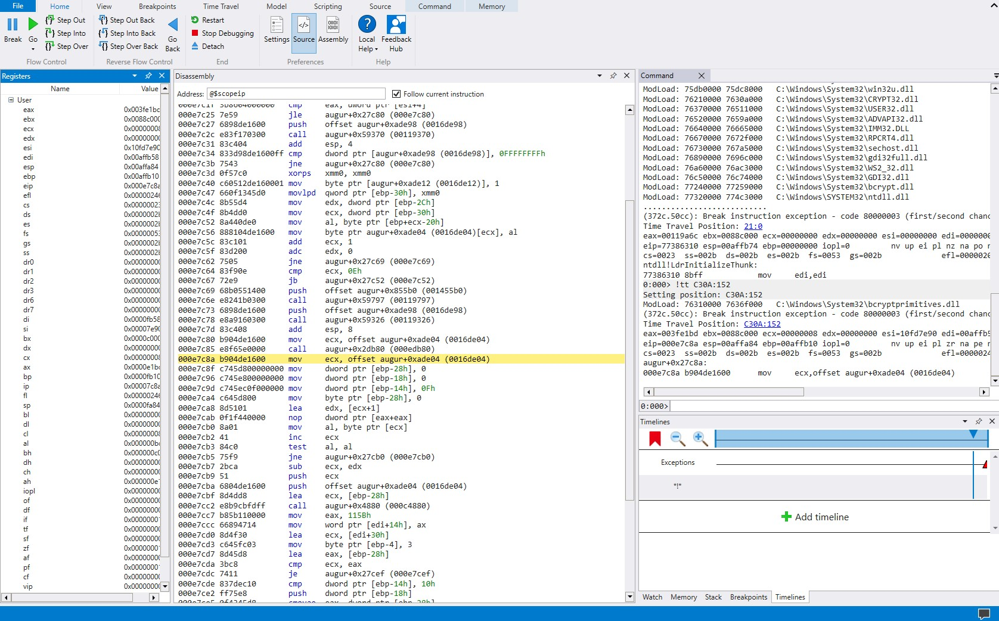

----

## UDB

[https://undo.io/](https://undo.io/)

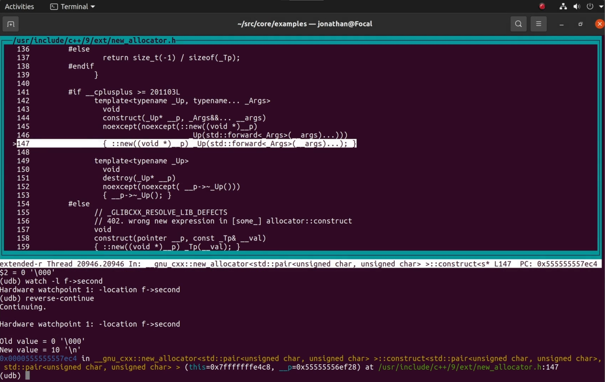

----

## Qira

[http://qira.me/](http://qira.me/)

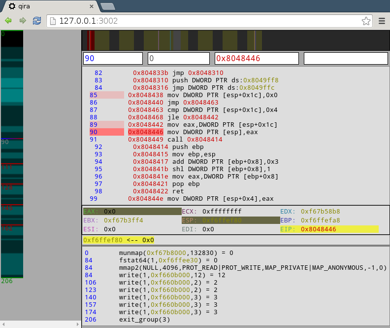

----

## Tenet

[https://github.com/gaasedelen/tenet](https://github.com/gaasedelen/tenet)

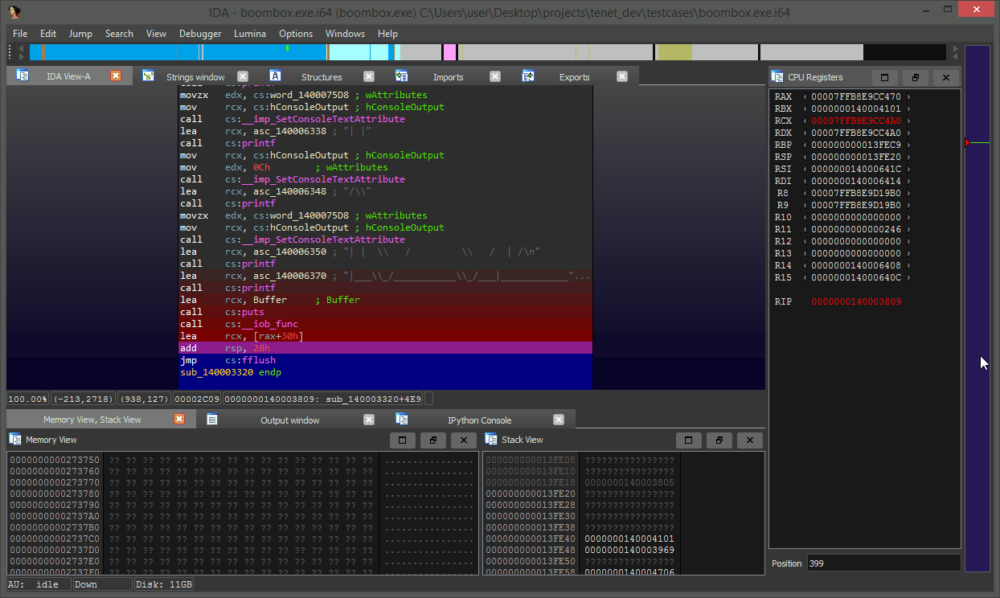

----

## rr + Pernosco

[https://rr-project.org/](https://rr-project.org/)

[https://pernos.co/](https://pernos.co/)
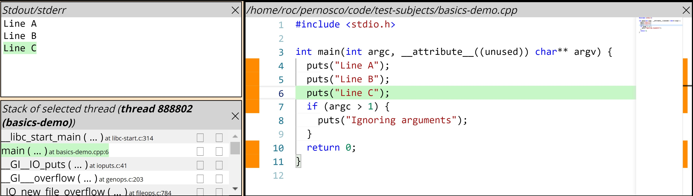

----

## Reven

[https://www.tetrane.com/](https://www.tetrane.com/)
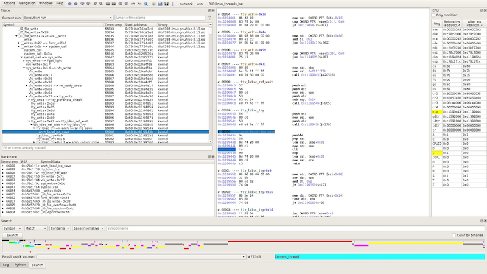

----

... and maybe others that I haven't tried or that are not available to the general public

----

## Choose your debugger

<!--
Lots of subjective stuff

|                             |     Panda     |   Windbg   |     UDB    |   Qira   |      Tenet      |    rr   |  Pernosco  |       Reven       |
|:---------------------------:|:-------------:|:----------:|:----------:|:--------:|:---------------:|:-------:|:----------:|:-----------------:|
|           Has GUI           |               |      Y     |     IDK    |     Y    |        Y        |         |      Y     |         Y         |
|       Kernel debugging      |       Y       |            |     IDK    |          |        Y*       |         |            |         Y         |
|       "True" timeless       |               |            |            |     Y    |        Y        |         |      Y     |         Y         |
| Billion+ instruction replay |       Y       |      Y     |     IDK    |          |                 |    Y    |     IDK    |      Kind of      |
|     Recording experience    |       D:      |     :D     |     IDK    | :( to :) | guess :) to :\| |    :D   |   uses rr  |        :\|        |
|     Needs HW assistance     |               | Y intel pt |     IDK    |          |                 |    Y    |   uses rr  |   virtualization  |
|       Dataflow + Taint      |    Kind of    |   Kind of  |   Kind of  |  Kind of |     Kind of     | Kind of |      Y     |         Y         |
|     Additional analyses     |       Y       |   Kind of  |     IDK    |          |                 |         |     IDK    |         Y         |
|         Open source         |       Y       |            |     IDK    |     Y    |        Y        |    Y    |            |                   |
|          Extensible         | Plugins + OSS |  Scripting |     IDK    |    OSS   | OSS + core APIs |   OSS   |     IDK    |     Scripting     |
|            Price            |      Free     |    Free    | Affordable |   Free   |       Free      |   Free  | Affordable | Kind of expensive |

-->
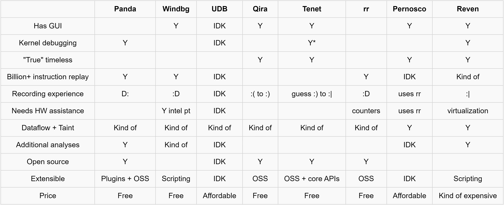

---

# DIY timeless debugging

----

## If there are so many timeless debugger why build another?

Wish list:
- work inside VMs without extra setup
- work reliably for triaging fuzzing results
- possible to extend both analyses and UI
- make use of source code or decompiled code
- easy to record, easy to replay
- no monkey patching qemu please

----

## Wish list vs existing solutions

Many solutions come close:
- Qira/Tenet are the closest, but easier to rewrite than to understand and extend
- Panda difficult to use
- Reven good, if someone else prepares the recording for you
- Windbg, UDB, rr not real timeless
- Pernosco only cloud solution for general public

----

## My failed attempts

----

### 2019 - qira ghidra (not released)

Qira a bit unreliable

<video preload="metadata" muted controls>
    <source src="assets/lq_qiraghidra.mp4" type="video/mp4">
</video>

----

### 2019 - rr ghidra (not released)

<small>
rr frontend, 1 instance for current state, multiple workers to peek into the future and into the past, replay too slow
</small>

<video preload="metadata" muted controls>
    <source src="assets/lq_rrghidra.mp4" type="video/mp4">
</video>

----

### dina ttd (not released)

<small>
Inspired by iDNA, good recording thanks to iDNA's papers, indexing too slow due to slow cpu emulation
</small>

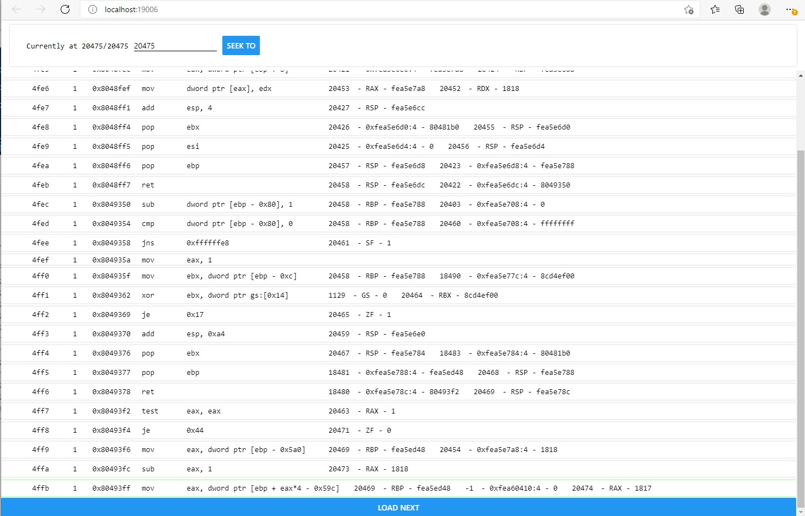

----

### latest attempt (maybe will release?)

<small>
Tracer inspired by Qira using a reliable DBI framework, good performance for fuzzing cases, very good (subjectively) debugging experience, moderate memory footprint
</small>

<video preload="metadata" muted controls>
    <source src="assets/lq_latest.mp4" type="video/mp4">
</video>

----

### DIY timeless

- Use proper DBI framework to log memory and register changes and accesses
- Use syscall models for data flow across syscalls
- Expose generic APIs to the client
- Index everything that can be useful
    - Call times
    - Syscall times

----

### DIY timeless: cost


- memory = X bytes * instructions * Y indexing overhead
    - X ~= 30, Y ~= 8 at the moment
    - /4 if stored in compressed fs = large margin of improvement
- time index around 10^6 ins/s/core (single thread for now)
- query time binary search or hashmap accesses
    - very fast for interactive use
    - fast enough for analyses


---

# Combining dynamic analyses with timeless debugging

----

## Repeatable reverse engineering

From authors of *Repeatable Reverse Engineering with PANDA*

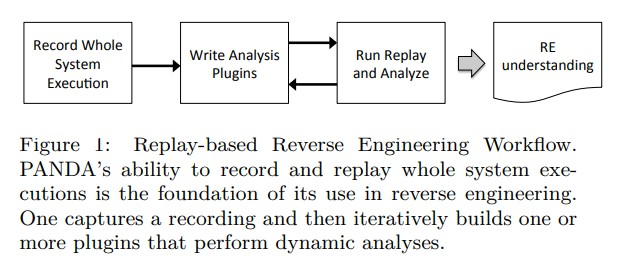

<!--
I want to get across these points:

- record replay debugging is a full trace compression problem
    - compressed trace and uncompressed trace complement each other
        - compressed for storage
- there are different classes of analyses, some are easier and faster to write sequentially others are better using an index
- full trace is simpler to implement
- what are the core set of features of a timeless debugger and how to use them
    - features that are in the class "can be done with traditional debuggers, but this is kind of better"
    - features that are very hard to implement without record replay
- each analyses pass reveals something more about the execution
    - single stepping is hard because the amount of information is huge, having different levels of zoom can help
- examples with fault localization
    - differential debugging

-->

----

## Missing pieces

- No good debugger or UI
- Not easy to implement plugins
- Very slow, it's like helping someone debug via email
- Emulating full OS > very likely something goes wrong
- Overkill for small cases
    - Recording very painful
    - Needs a lot of discipline

----

## How to fix (for triaging fuzzing crashes)?

- Complement analyses with a reliable debugger and good UI
- Put human at the center
    - Turn all repetitive actions into analyses
    - Make analyses results interactive
    - Visualization #1 priority
    - Make all high level info available
    - Prioritize fast analyses and cache results
- Pernosco and Reven are good examples

----

## Example 1/3 : Call Tree

- Normal debugging can only have call stack timeless can recover whole call tree
- Addresses and time are clickable, sync other views
- Argument values are resolved

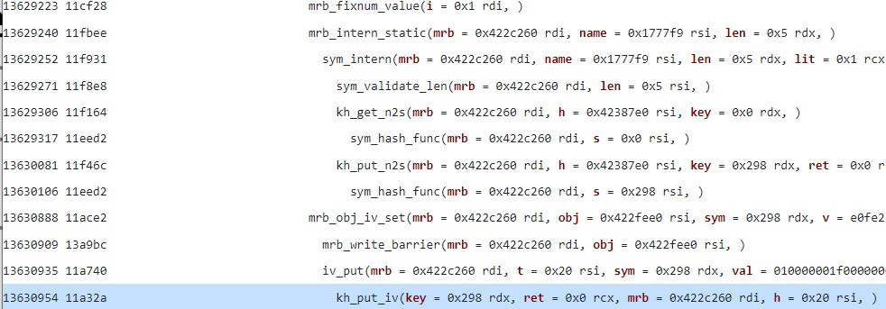

----

## Example 2/3 : Backwards taint

- Data flow visualized as graph
- Show graph progressively, human chooses which values to follow
- Clicking syncs views
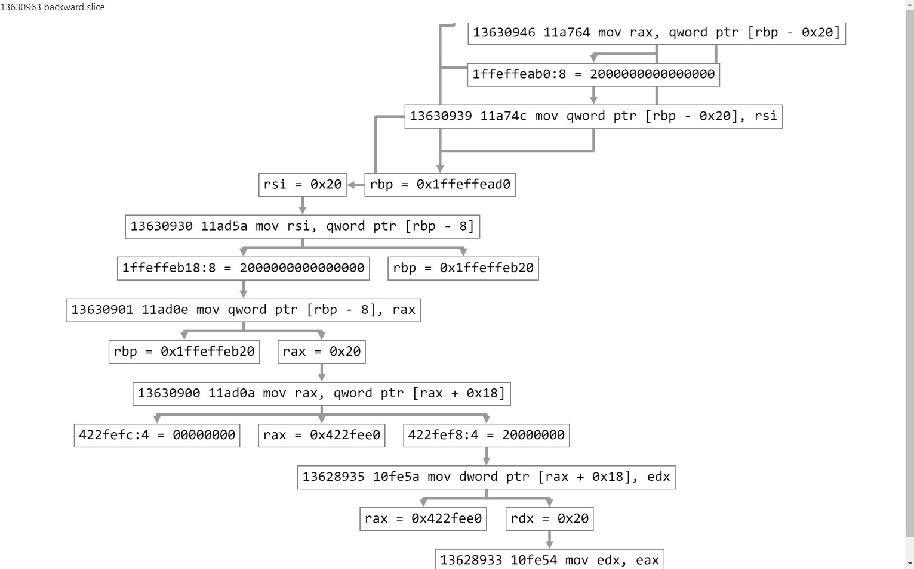

----

## Example 3/3 : Source code view
- Show consistent variable values
- Not yet, but planned: click and see when some line was executed

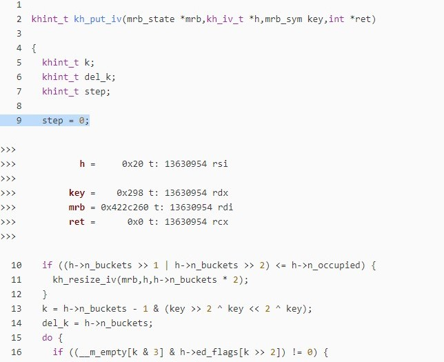

---

# A different paradigm for dynamic analyses

----

## Dynamic analyses via binary instrumentation

- At each instrumentation point choose what to save what to forget
- Make decisions based on past
- Save too much for the analysis
- Save too little for debugging

----

## Compiler sanitizer passes

- Widely used dynamic analyses
- Production ready
- Resulting binary is dirty
    - Debugging the crash not enjoyable

----

## Sanitizer example: ASAN
Address Sanitizer
- Place "red zones" around memory on stack and heap
- For each memory access check if red zone is poisoned (must not be touched)
- Quarantine free memory

```c
// Before:
*address = ...;  // or: ... = *address;
// After:
if (IsPoisoned(address)) {
  ReportError(address, kAccessSize, kIsWrite);
}
*address = ...;  // or: ... = *address;
```

<small>
From <a href="https://github.com/google/sanitizers/wiki/AddressSanitizerAlgorithm">https://github.com/google/sanitizers/wiki/AddressSanitizerAlgorithm</a>
</small>

----

## Sanitizer example: ASAN with timeless abstraction
(Not yet implemented)
- At runtime only add red zones, don't do checks
- During replay check all red zones for accesses
    - Filter accesses at times where red zone is inactive
    - Highlight red zone source and faulting time/instruction
    - Triage the violation using the debugger
- However ASAN is much faster compared to recording a timeless trace

<!--
 ----

## Transposing the problem

So in the ASAN example, using the timeless abstraction, we can transpose the problem
- From checking all accesses for red zones
- To checking all red zones for accesses

Which is common with other analyses
- name one?
 ----
-->


---

# Demo
# Fault localization with a DIY timeless debugger

----

## Test binary

- mruby - ruby language interpreter
- Test case from [https://github.com/RUB-SysSec/aurora](https://github.com/RUB-SysSec/aurora)
    <small>(Aurora: Statistical Crash Analysis for Automated Root Cause Explanation)</small>
- Crash invalid read at address 28
- Root cause invalid implicit cast to type confusion
- Bug report [https://hackerone.com/reports/185041](https://hackerone.com/reports/185041)

----

## The test case

```ruby
NotImplementedError = String
Module.constants # mrb_raise(mrb, E_NOTIMP_ERROR, "Module.constants not implemented");
```

----

## Backwards taint 1/3 : if you have a hammer...

- We examine the trace, the last instruction reads from 28, an invalid address
- First idea is to see how we got 28 > we can follow the backwards taint graph
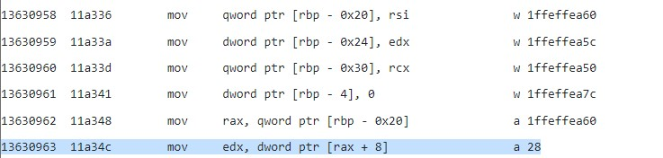

----

## Backwards taint 2/3 : ... anything can become a nail
```c
mrb_value mrb_mod_s_constants(mrb_state *mrb,mrb_value mod) {
    ...
    mrb_00 = local_10;
    mrb_raise(local_10,c,"Module.constants not implemented");
    lStack56 = *(long *)(in_FS_OFFSET + 0x28);
    uVar2 = extraout_RDX;
    ...
}

mrb_value str_replace(mrb_state *mrb,RString *s1,RString *s2) {
    ...
        __src = &s2->as;
    ...
    memcpy(&s1->as,__src,__n); // s1 = 0x422fee0 t: 13628556 rsi

    ...
}

void mrb_obj_iv_set(mrb_state *mrb,RObject *obj,mrb_sym sym,mrb_value v) {
    ...
    t = obj->iv; // obj = 0x422fee0 t: 13630887 rsi
    ...
}

```
----

## Backwards taint 3/3 : Deadend at the end of the flow

- Unlikely that you would spot that unless you were looking for type confusions
- We did find one important clue for the bug though

```c
mrb_value mrb_mod_s_constants(mrb_state *mrb,mrb_value mod) {
    ...
    RClass *c;
    ...
    c = mrb_class_get(mrb,"NotImplementedError");
    ...
    mrb_raise(local_10,c,"Module.constants not implemented");
    ...

}

```

----

## Enter statistical debugging

<small><a href="https://www.debuggingbook.org/beta/html/StatisticalDebugger.html">The Debugging Book > Statistical Debugging
</a></small>

- Idea: take several test cases (in our case 4), record some events, compare events from different runs
- Example:
    - event = instruction at pc executed (or function or basic block)
    - compare = put results in a table

----

## Statistical debugging: our test cases

```ruby
# 1

# 2
NotImplementedError = String

# 3
Module.constants

# 4
NotImplementedError = String
Module.constants

```

----

## Results

If we are lucky the root cause is a wrongly called function or near a function call

Otherwise we need to look at differences in data
- for binaries - Aurora: Statistical Crash Analysis for Automated Root Cause Explanation
- in general - invariant mining, likely invariants, ... Daikon?

Originally I wanted to show this part too, but not enough time

---

## Demo time: Dataflow

<video preload="metadata" muted controls>
    <source src="assets/lq_teaser.mp4" type="video/mp4">
</video>

----


## Demo time: Statistical + differential debugging

<video preload="metadata" muted controls>
    <source src="assets/lq_differential_debugging.mp4" type="video/mp4">
</video>

<!--
    ## Compiler based

    **Asan, Ubsan, Msan**

    ---
    ## Dynamic instrumentation

    **Valgrind tools, pin tool, dynamorio**

    ---
    # Introduction: Record Replay debugging

    Briefly talk about the various alternatives and available products in the market

    There is a whole range of approaches.
    The basic idea is that we can record a trace of every effect on the program state:

    - read and writes to registers
    - read and writes to memory

    Traces obtained in this way can take up a lot of space if they are very long especially if you are using an hard disk

    So people designed what effectively are "compression algorithms" for traces, where the decompressor is usually something that understands machine instructions (i.e. binary instrumentation, emulation, …)


    - for something more than just replay, you need to model "external changes" like
        - For user space
            - syscalls
            - a way to capture memory changes from one thread to the other
            - signals
        - For whole system
            - dma
            - io
            - emulated devices

    There are pro and cons for each approach, uncompressed traces can be indexed with a low additional overhead to unlock random access in the trace

    While compressed traces can let you record "giga traces" (billion + instruction traces) without any issue


    ---
    ## Qira
    ---
    ## Qemu record replay / Panda / Tetrane Reven
    ---
    ## rr + pernosco
    ---
    ## Windbg preview + idna and co.
    ---
    ## Others

    **Undodb**
    **replay.io**
    **omniscient debugger**

    ##
    ---
    # Part 1: Valqira
    ---
    ## Analyses we expect from record replay debugging

    The timeless debugging starter pack
    **Dataflow**
    **Call stack**
    **Function trace**
    **Value history**


    ---
    ## Analyses that exist, but I have not implemented

    **Frame buffer visualization**
    **Output to time**

    ---
    ## Analyses that we know exist, but never saw a public implementation

    **Offline symbolic execution**

    ---
    # Part 2: Dynamic analyses
    ---
    ## Fault localization

    **Execution trace based (includes control flow based)**
    **Data based**
    **Generalize aurora**


-->